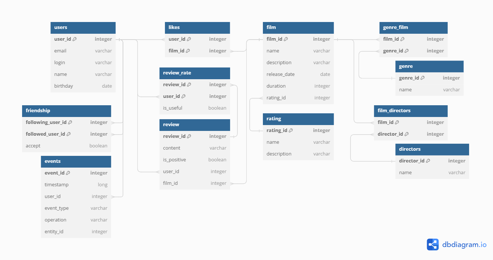

# java-filmorate
Приложение JAVA FILMORATE - социальная сеть для любителей кино. 

Функциональность: 
- хранение информации о фильмах и пользователях (пока in memory, позже - в РБД).
- формирование рейтинга отдельных фильмов путем добавления лайков пользователем.
- взаимодействие между отдельными пользователями приложения путем добавления друг друга в друзья.

На текущем этапе приложение хранит данные в течение времени работы сервера. Такой способ хранения 
ставит под угрозу сохранность информации, связанной с бизнес-логикой, и отрицает возможность 
дальнейшего расширения приложения. 
Ниже представлена диаграмма, описывающая структуру реляционной базы данных, которая будет 
лежать в основе механизма хранения данных приложения JAVA FILMORATE и её краткое описание.



`film`

Содержит данные об отдельных фильмах.
Таблица включает такие поля:
  - первичный ключ `film_id` - идентификатор фильма;
  - `name` — название фильма;
  - `description` - описание фильма;
  - `release_date` - дата выпуска;
  - `duration` - продолжительность в минутах;
  - внешний ключ `mpa_id` (ссылается на таблицу `mpa`) - идентификатор возрастного рейтинга.


`likes`

Таблица-связка содержит информацию о фильмах и лайках к ним от разных пользователей.
Таблица включает такие поля:
  - `film_id` - часть составного первичного ключа (ссылается на таблицу `films`), идентификатор фильма;
  - `user_id` - часть составного первичного ключа (ссылается на таблицу `users`), идентификатор пользователя.


`rating`

Содержит данные о возрастных рейтингах фильмов.
Таблица включает такие поля:
  - первичный ключ `rating_id` - идентификатор возрастного рейтинга;
  - `name` — наименование отметки о возрастном рейтинге;
  - `description` - описание отметки о возрастном рейтинге.


`genre`

Содержит данные о жанрах фильмов приложения.
Таблица включает такие поля:
  - первичный ключ `genre_id` - идентификатор жанра;
  - `name` — наименование жанра.


`genre_film`

Таблица-связка содержит информацию о фильмах и их жанрах.
Таблица включает такие поля:
  - `film_id` - часть составного первичного ключа (ссылается на таблицу `films`), идентификатор фильма;
  - `genre_id` - часть составного первичного ключа (ссылается на таблицу `genres`), идентификатор жанра фильма.


`users`

Содержит данные об отдельных пользователях.
Таблица включает такие поля:
  - первичный ключ `user_id` - идентификатор пользователя;
  - `email` — адрес электронной почты пользователя;
  - `login` - логин пользователя;
  - `name` - имя пользователя;
  - `birthday` - день рождения пользователя.


`friendship`

Содержит данные о статусе для связи «дружба» между двумя пользователями.
Таблица включает такие поля:
- `following_user_id` - часть составного первичного ключа (ссылается на таблицу `users`), идентификатор пользователя, 
отправившего заявку на добавление в друзья;
- `followed_user_id` - часть составного первичного ключа (ссылается на таблицу `users`), идентификатор пользователя, 
которому была отправлена заявка на добавление в друзья;
- `accept` - отношение пользователя followed_user к пользователю following_user (в случае, если followed_user
  примет заявку following_user, поле примет значение 1. Если решит отклонить заявку, проигнорирует её или удалит following_user из
  списка друзей - 0).


Примеры запросов к описанной базе данных: 
- Получение перечня всех фильмов
```agsl
SELECT * 
FROM films;
```

- Получение фильма с id = 3
```agsl
SELECT * 
FROM films 
WHERE film_id = 3;
```

- Получение 10 самых популярных фильмов
```agsl
SELECT f.film_id, COUNT(l.user_id) as likes_amount 
FROM films as f 
RIGHT JOIN likes as l ON f.film_id = l.film_id 
GROUP BY f.film_id 
ORDER BY likes_amount 
LIMIT 10;
```

- Добавление нового фильма(в поле `film_id` ничего не добавляем, поскольку оно будет IDENTITY)
```agsl
INSERT INTO films 
(name, description, release_date, duration, mpa_id) 
VALUES 
('Любовная любовь', 'Они смогли полюбить, но не смогли разлюбить...', '2022-02-02', 200, 3);
```

- Обновление информации о фильме с id = 3
```agsl
UPDATE films 
SET release_date = '2001-01-01'
WHERE film_id = 3;
```

- Добавление пользователем c id = 1 лайка фильму c id = 2
```agsl
INSERT INTO likes 
VALUES 
(1,2);
```

- Удаление пользователем c id = 1 лайка с фильма c id = 2
```agsl
DELETE 
FROM likes 
WHERE film_id = 2 AND user_id = 1;
```

- Добавление нового пользователя(в поле `user_id` ничего не добавляем, поскольку оно будет IDENTITY)
```agsl
INSERT INTO users 
(email, login, name, birthday) 
VALUES 
('ivanov@gmail.com', 'ivan_ivanov24', 'Иван Иванов', '1992-02-02');
```

- Обновление информации о пользователе с id = 2
```agsl
UPDATE users 
SET birthday = '2005-11-11'
WHERE user_id = 2;
```

- Получение перечня с информацией обо всех пользователях
```agsl
SELECT * 
FROM users;
```

- Получение информации о пользователе с id = 1
```agsl
SELECT * 
FROM users 
WHERE user_id = 1;
```

- Отправка пользователем c id = 1 заявки на "дружбу" пользователю c id = 2
```agsl
INSERT INTO friendship  
VALUES 
(1,2,true,false);
```

- Одобрение пользователем c id = 2 заявки на "дружбу" пользователя c id = 1
```agsl
UPDATE friendship 
SET followed_user_accept = true
WHERE following_user_id = 1 AND followed_user_id = 2;
```

- Удаление пользователем с id = 1 пользователя с id = 2 из друзей (подписка пользователя с id = 2 на пользователя с id = 1 
остается)
```agsl
UPDATE friendship 
SET following_user_accept = false
WHERE following_user_id = 1 AND followed_user_id = 2;
```

- Получение информации о друзьях пользователя с id = 3
```agsl
SELECT u.* 
FROM 
((SELECT followed_user_id 
 FROM friendship 
 WHERE following_user_id = 3)
	UNION
(SELECT following_user_id 
 FROM friendship 
 WHERE followed_user_id = 3)) AS friends_ids 
 LEFT JOIN users AS u ON u.user_id = friends_ids.followed_user_id;
```

- Получение информации об общих друзьях пользователей с id = 1 и 3 
```agsl
SELECT u2.* 
FROM 
((SELECT u.user_id 
FROM 
((SELECT followed_user_id 
 FROM friendship 
 WHERE following_user_id = 3 AND following_user_accept = true AND followed_user_accept = true)
	UNION
(SELECT following_user_id 
 FROM friendship 
 WHERE followed_user_id = 3 AND following_user_accept = true AND followed_user_accept = true)) AS friends_ids 
 LEFT JOIN users AS u ON u.user_id = friends_ids.followed_user_id)
 
 INTERSECT 
 
 (SELECT u.user_id 
FROM 
((SELECT followed_user_id 
 FROM friendship 
 WHERE following_user_id = 1 AND following_user_accept = true AND followed_user_accept = true)
	UNION
(SELECT following_user_id 
 FROM friendship 
 WHERE followed_user_id = 1 AND following_user_accept = true AND followed_user_accept = true)) AS friends_ids 
 LEFT JOIN users AS u ON u.user_id = friends_ids.followed_user_id)) AS common_friends
 LEFT JOIN users as u2 ON common_friends.user_id = u2.user_id;
```

